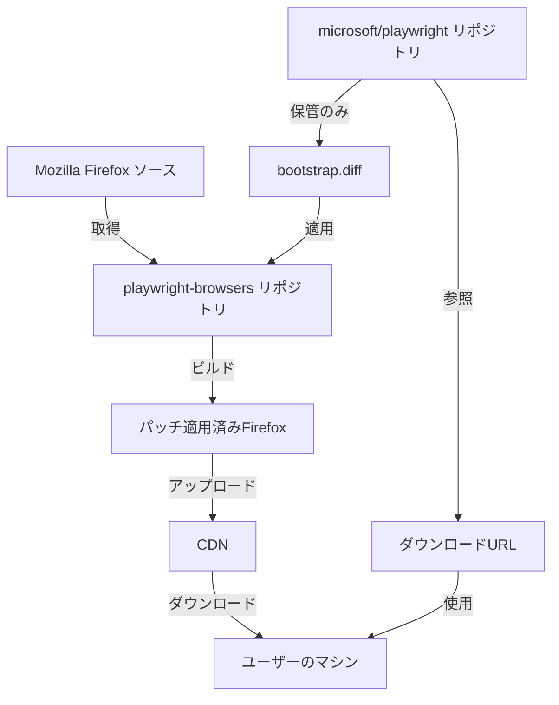

# bootstrap.diffが適用される証拠と仕組み

## 重要な発見

**このPlaywrightリポジトリ内では、bootstrap.diffは直接適用されません。**

パッチの適用は、**別の内部リポジトリ（playwright-browsers）**で行われています。

## 証拠1: roll_from_upstream.shスクリプト

`browser_patches/roll_from_upstream.sh`が示す重要な事実：

```bash
# A script to roll browser patches from internal repository.

if [[ $(basename "${SOURCE_DIRECTORY}") != "playwright-browsers" ]]; then
  echo "ERROR: the source directory must be named 'playwright-browsers'"
  exit 1
fi

files=(
  "./firefox/juggler/"
  "./firefox/patches/"  # ← bootstrap.diffを含むパッチディレクトリ
  "./firefox/preferences/"
  "./firefox/UPSTREAM_CONFIG.sh"
  # ...
)

# playwright-browsersリポジトリから現在のリポジトリにコピー
for file in "${files[@]}"; do
  rsync -av --delete "${SOURCE_DIRECTORY}/browser_patches/${file}" "${SCRIPT_PATH}/${file}"
done
```

このスクリプトから分かること：
1. **playwright-browsers**という内部リポジトリが存在
2. そこでパッチの適用とビルドが行われる
3. 完成したパッチとビルド成果物がこのリポジトリにコピーされる

## 証拠2: ビルドプロセスの分離

### 公開リポジトリ（microsoft/playwright）の役割
- パッチファイルの**保管**のみ
- ビルド済みブラウザの**ダウンロード**
- ユーザー向けのAPIとツール提供

### 内部リポジトリ（playwright-browsers）の役割
- Firefoxソースコードの取得
- **bootstrap.diffの適用**
- 各プラットフォーム向けのビルド
- CDNへのアップロード

## 証拠3: ダウンロードされるFirefox

`packages/playwright-core/src/server/registry/index.ts:223-249`で定義されるURL：

```javascript
'firefox': {
  'mac15-arm64': 'builds/firefox/%s/firefox-mac-arm64.zip',
  'ubuntu22.04-x64': 'builds/firefox/%s/firefox-ubuntu-22.04.zip',
  'win64': 'builds/firefox/%s/firefox-win64.zip',
  // ...
}
```

これらは**すでにビルド済み**のバイナリを指しています。

## パッチ適用の実際のフロー



## なぜパッチがこのリポジトリにあるのか

1. **透明性**: ユーザーがパッチ内容を確認できる
2. **バージョン管理**: パッチの変更履歴を追跡
3. **コラボレーション**: 外部からの貢献を受け入れ可能
4. **ドキュメント**: どのような変更が加えられているか明確

## 実際のビルドプロセス（推測）

内部のplaywright-browsersリポジトリでは、おそらく以下のようなプロセス：

1. **Firefoxソースの取得**
   ```bash
   git clone https://github.com/mozilla-firefox/firefox
   git checkout 00656c9425c51ee035578ca6ebebe13c755b0375  # BASE_REVISION
   ```

2. **パッチの適用**
   ```bash
   git apply browser_patches/firefox/patches/bootstrap.diff
   ```

3. **Jugglerコンポーネントのコピー**
   ```bash
   cp -r browser_patches/firefox/juggler/ firefox-source/juggler/
   ```

4. **ビルド**
   ```bash
   ./mach build  # Firefoxのビルドコマンド
   ```

5. **パッケージング**
   ```bash
   zip firefox-mac-arm64.zip firefox/
   ```

6. **CDNアップロード**
   ```bash
   upload-to-cdn firefox-mac-arm64.zip
   ```

## まとめ

- **bootstrap.diffは内部リポジトリで適用される**
- **公開リポジトリはパッチの保管とダウンロード機能のみ**
- **ユーザーは常にビルド済みバイナリを受け取る**
- **ビルドプロセスは完全に自動化され、CDNで配布**

これにより、ユーザーは複雑なビルドプロセスを意識することなく、パッチ適用済みのFirefoxを利用できます。