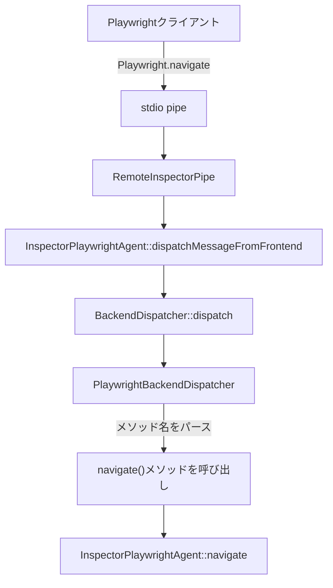

# PlaywrightドメインとInspectorPlaywrightAgentの関係

## 質問への回答

**「PlaywrightはInspectorPlaywrightAgentと同一」ではありません。**

正確には：
- `Playwright` = プロトコルの**ドメイン名**
- `InspectorPlaywrightAgent` = そのドメインの**実装クラス**

## WebKit Inspectorプロトコルのアーキテクチャ

### 1. プロトコル定義層

`Playwright.json`で定義（bootstrap.diff line 1198-1512）:
```json
{
    "domain": "Playwright",  // ドメイン名
    "commands": [
        {
            "name": "navigate",  // コマンド名
            "parameters": [
                { "name": "url", "type": "string" },
                { "name": "pageProxyID", "type": "string" },
                { "name": "frameID", "type": "string", "optional": true },
                { "name": "referrer", "type": "string", "optional": true }
            ],
            "returns": [
                { "name": "navigationID", "type": "string", "optional": true }
            ]
        }
    ]
}
```

### 2. 自動生成層

WebKitのビルドプロセスで自動生成される：

```cpp
// 自動生成されるクラス（推定）
namespace Inspector {
    // インターフェース
    class PlaywrightBackendDispatcherHandler {
        virtual void navigate(const String& url, 
                            const String& pageProxyID,
                            const String& frameID,
                            const String& referrer,
                            Ref<NavigateCallback>&&) = 0;
    };
    
    // ディスパッチャー
    class PlaywrightBackendDispatcher : public BackendDispatcher {
        // "Playwright.navigate" → handler->navigate() への変換
    };
}
```

### 3. 実装層

`InspectorPlaywrightAgent`が実装（bootstrap.diff line 14162-14200）:

```cpp
class InspectorPlaywrightAgent final
    : public Inspector::PlaywrightBackendDispatcherHandler  // インターフェース実装
{
    // Playwright.navigate の実装
    void navigate(const String& url, const String& pageProxyID, 
                 const String& frameID, const String& referrer,
                 Ref<NavigateCallback>&& callback) override {
        // 実際の処理
    }
}
```

## 処理の流れ



## 他のドメインとの比較

WebKitには複数のプロトコルドメインが存在：

| ドメイン名 | 実装クラス | 役割 |
|-----------|-----------|------|
| Playwright | InspectorPlaywrightAgent | Playwright固有の機能 |
| Page | InspectorPageAgent | ページ操作 |
| Runtime | InspectorRuntimeAgent | JavaScript実行 |
| DOM | InspectorDOMAgent | DOM操作 |
| Network | InspectorNetworkAgent | ネットワーク監視 |

## まとめ

1. **Playwright**はプロトコルドメイン名（名前空間のようなもの）
2. **InspectorPlaywrightAgent**はそのドメインの実装
3. **PlaywrightBackendDispatcher**が両者をつなぐ（自動生成）
4. `Playwright.navigate` → `InspectorPlaywrightAgent::navigate()` への変換は自動的に行われる

この設計により、プロトコル定義と実装が分離され、保守性が高まっています。