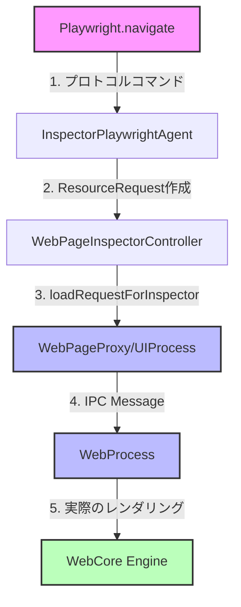

# WebKitの画面遷移における内部API利用の詳細

## 質問への回答

**はい、WebKitの内部APIを使用して画面遷移を実現しています。**

## ナビゲーション処理の詳細なフロー

### レイヤー1: Playwrightプロトコル層

```cpp
// InspectorPlaywrightAgent::navigate (bootstrap.diff line 13735-13778)
void InspectorPlaywrightAgent::navigate(const String& url, const String& pageProxyID, ...) 
{
    // 1. WebCore::ResourceRequestを作成（WebKitの内部クラス）
    auto resourceRequest = WebCore::ResourceRequest(URL { url });
    
    // 2. HTTPリファラーを設定（必要な場合）
    if (!!referrer)
        resourceRequest.setHTTPReferrer(referrer);
    
    // 3. WebPageInspectorControllerに委譲
    pageProxyChannel->page().inspectorController().navigate(
        WTFMove(resourceRequest), 
        frame, 
        callback
    );
}
```

### レイヤー2: インスペクターコントローラー層

```cpp
// WebPageInspectorController::navigate (bootstrap.diff line 12554-12563)
void WebPageInspectorController::navigate(WebCore::ResourceRequest&& request, 
                                         WebFrameProxy* frame, 
                                         NavigationHandler&& completionHandler)
{
    // WebPageProxyの内部APIを呼び出し
    auto navigation = m_inspectedPage->loadRequestForInspector(
        WTFMove(request), 
        frame
    );
    
    // ナビゲーションIDをコールバックで管理
    m_pendingNavigations.set(navigation->navigationID(), 
                            WTFMove(completionHandler));
}
```

### レイヤー3: WebPageProxy層（UIProcess）

```cpp
// WebPageProxy::loadRequestForInspector (bootstrap.diff line 15705-15717)
RefPtr<API::Navigation> WebPageProxy::loadRequestForInspector(
    WebCore::ResourceRequest&& request, 
    WebFrameProxy* frame)
{
    if (!frame || frame == mainFrame()) {
        // メインフレームの場合は通常のloadRequest APIを使用
        return loadRequest(WTFMove(request), 
                         WebCore::ShouldOpenExternalURLsPolicy::ShouldNotAllow);
    }
    
    // サブフレームの場合
    auto navigation = m_navigationState->createLoadRequestNavigation(...);
    LoadParameters loadParameters;
    loadParameters.navigationID = navigation->navigationID();
    loadParameters.request = WTFMove(request);
    
    // WebProcessにIPCメッセージを送信
    m_legacyMainFrameProcess->send(
        Messages::WebPage::LoadRequestInFrameForInspector(
            WTFMove(loadParameters), 
            frame->frameID()
        ), 
        m_webPageID
    );
    
    return navigation;
}
```

### レイヤー4: プロセス間通信（IPC）

```cpp
// WebProcessへのメッセージ送信
Messages::WebPage::LoadRequest(loadParameters)
// または
Messages::WebPage::LoadRequestInFrameForInspector(loadParameters, frameID)
```

### レイヤー5: WebProcess層（実際のレンダリング）

WebProcessが受信したメッセージを処理し、実際のページロードを実行します。

## 使用されるWebKit内部API/クラス

### 1. WebCore層のクラス
- `WebCore::ResourceRequest` - HTTPリクエストの表現
- `WebCore::URL` - URL処理
- `WebCore::NavigationIdentifier` - ナビゲーションの識別子
- `WebCore::PolicyAction` - ナビゲーションポリシー
- `WebCore::ShouldOpenExternalURLsPolicy` - 外部URL処理ポリシー

### 2. WebKit2層のクラス
- `WebPageProxy` - UIProcessでのWebページ表現
- `WebFrameProxy` - UIProcessでのフレーム表現
- `WebProcessProxy` - WebProcessとの通信管理
- `API::Navigation` - ナビゲーションAPIオブジェクト
- `LoadParameters` - ページロードパラメータ

### 3. IPC（プロセス間通信）
- `Messages::WebPage::LoadRequest` - ページロードメッセージ
- `Messages::WebPage::LoadRequestInFrameForInspector` - フレーム内ロードメッセージ

## アーキテクチャ図



## 重要なポイント

### 1. プロセス分離
- **UIProcess**: ユーザーインターフェース、セキュリティ、プロセス管理
- **WebProcess**: 実際のWebコンテンツのレンダリング
- IPCメッセージングで通信

### 2. セキュリティ
- `ShouldOpenExternalURLsPolicy::ShouldNotAllow` - 外部URLを開かない
- インスペクター経由のナビゲーションは特別扱い

### 3. 非同期処理
- ナビゲーションは非同期
- `NavigationIdentifier`でトラッキング
- コールバックベースの完了通知

## Firefoxとの比較

| 項目 | WebKit | Firefox |
|------|--------|---------|
| リクエスト表現 | WebCore::ResourceRequest | nsIURI |
| ナビゲーションAPI | WebPageProxy::loadRequest | browsingContext.loadURI |
| プロセスモデル | UIProcess/WebProcess分離 | 単一プロセス（e10s除く） |
| IPC | Messages::WebPage | XPCOM |
| フレーム管理 | WebFrameProxy | browsingContext |

## まとめ

WebKitの画面遷移は：

1. **WebKitの内部APIを直接使用**している
2. **UIProcess → WebProcess**の2プロセスアーキテクチャ
3. **IPC（プロセス間通信）**でメッセージをやり取り
4. **WebCore::ResourceRequest**でHTTPリクエストを表現
5. **非同期処理**でナビゲーションを管理

これにより、Playwrightは通常のJavaScript APIでは不可能な、ブラウザの深いレベルでの制御を実現しています。