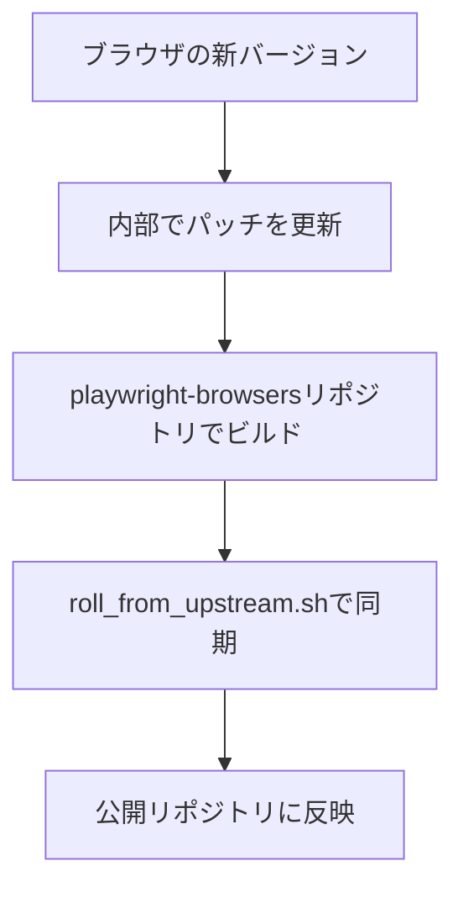

# bootstrap.diffの運用に関するドキュメントの調査結果

## 調査結果

**現在のPlaywrightリポジトリ内には、`bootstrap.diff`の運用に関する公式ドキュメントは見つかりませんでした。**

## 調査した場所

### 1. ドキュメントファイル
- `CONTRIBUTING.md` - パッチに関する記述なし
- `README.md` - ブラウザパッチに関する記述なし
- `docs/src/*.md` - エンドユーザー向けドキュメントのみ
- `browser_patches/` ディレクトリ内 - READMEファイルなし

### 2. 存在が確認できたファイル

#### 設定ファイル
```bash
browser_patches/firefox/UPSTREAM_CONFIG.sh
browser_patches/webkit/UPSTREAM_CONFIG.sh
```

これらは上流リポジトリの情報を含む：
- `REMOTE_URL` - ソースコードのリポジトリURL
- `BASE_BRANCH` - ベースブランチ
- `BASE_REVISION` - ベースとなるコミットハッシュ

#### スクリプト
```bash
browser_patches/roll_from_upstream.sh
```
内部の`playwright-browsers`リポジトリからパッチを同期するスクリプト

## 推測される運用フロー

### 1. パッチの管理場所
- **公開リポジトリ** (`microsoft/playwright`): パッチの保管と公開
- **内部リポジトリ** (`playwright-browsers`): 実際のビルドとパッチ適用

### 2. bootstrap.diffの役割
各ブラウザごとに存在：
- `browser_patches/firefox/patches/bootstrap.diff`
- `browser_patches/webkit/patches/bootstrap.diff`

これらは：
- ブラウザのソースコードに適用される変更の集合
- Playwright固有の機能を追加（プロトコル、API、通信機構）

### 3. パッチの更新プロセス（推測）



## 関連する発見

### browsers.jsonとの関係
```json
{
  "browsers": [
    {
      "name": "firefox",
      "revision": "..."  // パッチ適用済みビルドのバージョン
    }
  ]
}
```

### utils/roll_browser.js
ブラウザのバージョンを更新するスクリプト：
- browsers.jsonを更新
- 新しいビルドをダウンロード
- プロトコルタイプを生成

## ドキュメントが存在しない理由（推測）

1. **内部開発プロセス**: パッチの作成と管理はMicrosoft/Playwrightチームの内部プロセス
2. **複雑性**: ブラウザのソースコードレベルの変更は高度な専門知識が必要
3. **メンテナンス**: 頻繁に変更されるため、詳細なドキュメントの維持が困難

## 代替情報源

### コミットメッセージ
```bash
git log --oneline browser_patches/
```

### GitHub Issues/PR
パッチに関する議論や変更履歴

### ソースコード内のコメント
各パッチファイル内のコメントが唯一の説明

## まとめ

`bootstrap.diff`の運用に関する正式なドキュメントは存在しませんが：

1. **パッチファイル自体が仕様書** - diffファイルの内容が実装を説明
2. **スクリプトが運用を示す** - `roll_from_upstream.sh`が同期プロセスを示す
3. **内部プロセス** - 詳細な運用は内部チームのみが把握

外部貢献者がブラウザパッチを変更することは想定されていないため、詳細なドキュメントが公開されていないと考えられます。