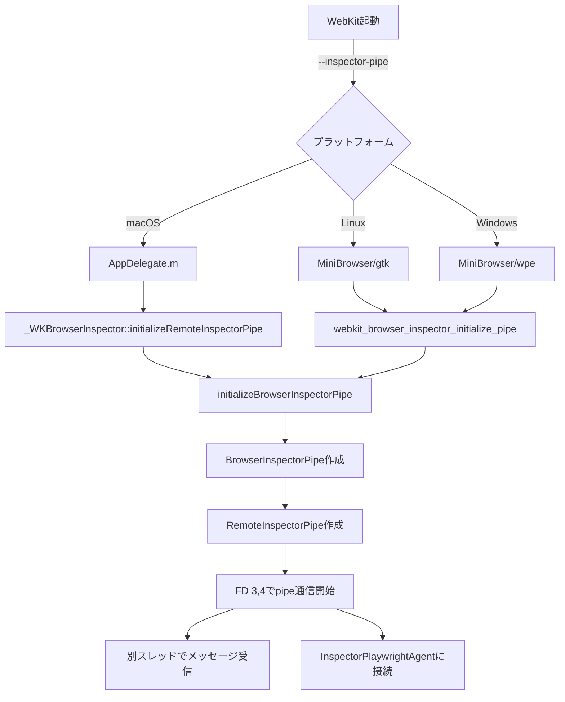

# WebKitの--inspector-pipeオプションとpipe通信実装の場所

## 概要

`--inspector-pipe`オプションを受け取り、pipe通信を行う実装は、プラットフォームごとに異なる場所にあります。

## 1. macOS実装

### エントリーポイント
**ファイル**: `browser_patches/webkit/embedder/Playwright/mac/AppDelegate.m`
```objc
// Line 129-130
if ([arguments containsObject: @"--inspector-pipe"])
    [_WKBrowserInspector initializeRemoteInspectorPipe:self headless:_headless];
```

### API定義
**パッチ**: `bootstrap.diff` line 9479-9480
```objc
@interface _WKBrowserInspector : NSObject
+ (void)initializeRemoteInspectorPipe:(id<_WKBrowserInspectorDelegate>)delegate headless:(BOOL)headless;
```

### 実装
**パッチ**: `bootstrap.diff` line 9531-9537
```objc
+ (void)initializeRemoteInspectorPipe:(id<_WKBrowserInspectorDelegate>)delegate headless:(BOOL)headless
{
#if ENABLE(REMOTE_INSPECTOR)
    InitializeWebKit2();
    PageClientImpl::setHeadless(headless);
    initializeBrowserInspectorPipe(makeUnique<InspectorPlaywrightAgentClientMac>(delegate, headless));
#endif
}
```

## 2. Linux/GTK実装

### エントリーポイント
**パッチ**: `bootstrap.diff` line 20763
```c
// オプション定義
{ "inspector-pipe", 0, 0, G_OPTION_ARG_NONE, &inspectorPipe, "Open pipe connection to the remote inspector", NULL }
```

### 初期化
**パッチ**: `bootstrap.diff` line 20845-20846
```c
if (inspectorPipe)
    configureBrowserInspectorPipe();
```

### 実装
**パッチ**: `bootstrap.diff` line 20830-20835
```c
static void configureBrowserInspectorPipe()
{
    WebKitBrowserInspector* browserInspector = webkit_browser_inspector_get_default();
    g_signal_connect(browserInspector, "create-new-page", G_CALLBACK(createNewPage), NULL);
    webkit_browser_inspector_initialize_pipe(proxy, ignoreHosts);
}
```

## 3. Windows/WPE実装

**パッチ**: `bootstrap.diff` line 20958
```c
{ "inspector-pipe", 'v', 0, G_OPTION_ARG_NONE, &inspectorPipe, "Expose remote debugging protocol over pipe", nullptr }
```

## 4. 共通実装部分

### BrowserInspectorPipe初期化
**パッチ**: `bootstrap.diff` line 10664-10681
```cpp
void initializeBrowserInspectorPipe(std::unique_ptr<InspectorPlaywrightAgentClient> client)
{
    // メインループを初期化
    WebKit::InitializeWebKit2();

    class BrowserInspectorPipe {
    public:
        BrowserInspectorPipe(std::unique_ptr<InspectorPlaywrightAgentClient> client)
            : m_playwrightAgent(std::move(client))
            , m_remoteInspectorPipe(m_playwrightAgent)  // ここでpipe通信開始
        {
        }

        InspectorPlaywrightAgent m_playwrightAgent;
        RemoteInspectorPipe m_remoteInspectorPipe;
    };

    static NeverDestroyed<BrowserInspectorPipe> pipe(std::move(client));
}
```

### RemoteInspectorPipeクラス
**パッチ**: `bootstrap.diff` line 14690-14726（コンストラクタ）
```cpp
RemoteInspectorPipe::RemoteInspectorPipe(InspectorPlaywrightAgent& playwrightAgent)
    : m_playwrightAgent(playwrightAgent)
{
    m_remoteFrontendChannel = makeUnique<RemoteFrontendChannel>();
    start();  // pipe通信を開始
}

bool RemoteInspectorPipe::start()
{
    // ファイルディスクリプタ3,4を使用
    const int readFD = 3;
    const int writeFD = 4;
    
    // 読み取りスレッドを作成
    m_receiverThread = Thread::create("Inspector pipe reader"_s, [this] {
        workerRun();  // 別スレッドでメッセージ受信
    });
    
    // InspectorPlaywrightAgentにフロントエンドを接続
    m_playwrightAgent.connectFrontend(*m_remoteFrontendChannel);
    
    return true;
}
```

## 処理フロー



## 重要なポイント

1. **プラットフォーム別エントリーポイント**
   - macOS: `AppDelegate.m`で処理
   - Linux/GTK: MiniBrowserで処理
   - Windows: WPEポートで処理

2. **共通実装**
   - `initializeBrowserInspectorPipe()`で統一処理
   - `RemoteInspectorPipe`がpipe通信を管理

3. **pipe通信の仕組み**
   - ファイルディスクリプタ3（読み込み）と4（書き込み）を使用
   - 別スレッドでメッセージを受信
   - `InspectorPlaywrightAgent`がプロトコル処理

## まとめ

`--inspector-pipe`オプションの処理は：

1. **プラットフォーム固有のコード**でオプションをパース
2. **initializeBrowserInspectorPipe()**で共通初期化
3. **RemoteInspectorPipe**がstdio pipe通信を確立
4. **InspectorPlaywrightAgent**がPlaywrightプロトコルを処理

これにより、PlaywrightとWebKitプロセス間の通信が確立されます。